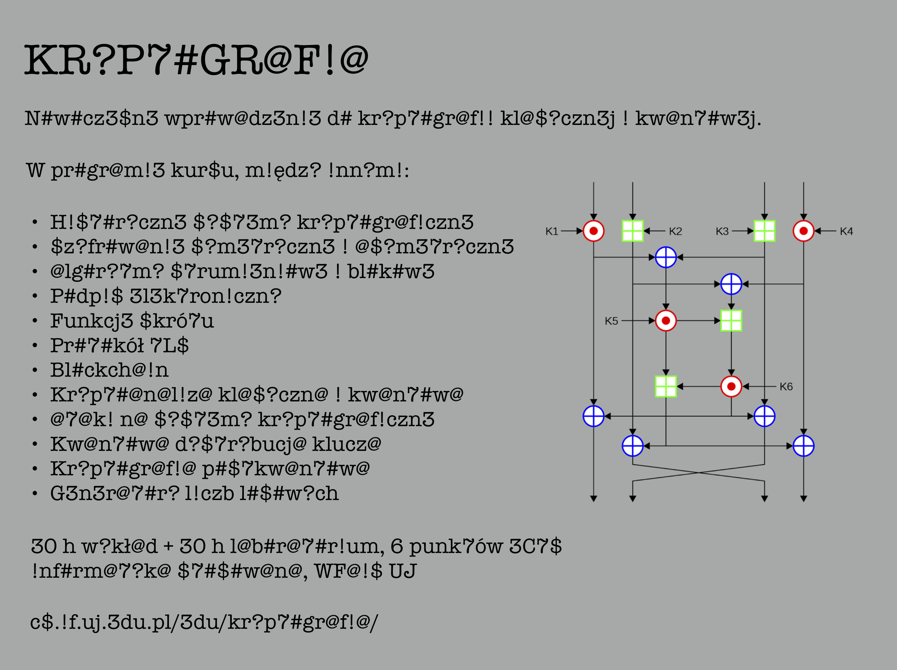

# Kryptografia 2026/27

Historyczna strona kursu: https://cs.if.uj.edu.pl/edu/kryptografia/

## Wykłady 

Środa, 10:00-11:30, sala F-1-04

Prowadzący: dr hab. Jakub Mielczarek, prof. UJ

Wykład będzie zakończony egzaminem pisemnym. 

Uzyskanie z laboratoriów oceny 5 podnosi ocenę z egzaminu o 1 stopień. Natomiast, uzyskanie oceny 4,5 podnosi 
ocenę z egzaminu o 0,5 stopnia.

## Laboratoria 

Czwartek,  13:00-14:30 gr. 1 (G-1-07); 14:30-16:00 gr. 3 (G-1-05); 14:30-16:00 gr. 2 (G-1-07).

Prowadzący: dr Piotr Czarnik, mgr Bartosz Grygielski 

- [Zasady zaliczenia](Zasady%20zaliczenia%20laboratoria.md)
- [Lista 1](Lista%201)

## Lista wykładów

- [Wykład 1 ](Kryptografia_1.pdf)
- [Uzupełnienie matematyczne 1](Kryptografia___uzupełnienie_matematyczne_1.pdf)
- [Uzupełnienie matematyczne 2](Kryptografia___uzupełnienie_matematyczne_2.pdf)
- [Uzupełnienie matematyczne 3](Kryptografia___uzupełnienie_matematyczne_3.pdf)

## Zestawy zadań 
