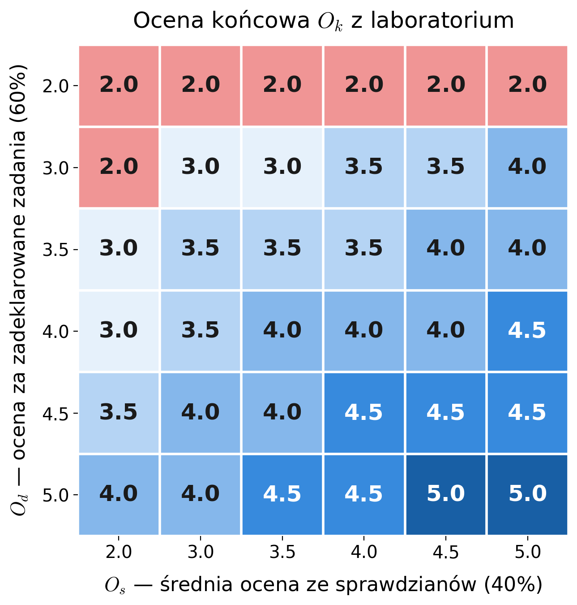

# Zasady zaliczenia laboratoriów

## Przebieg zajęć

- Na zajęcia studenci przychodzą z rozwiązanymi listami zadań, które będą przesyłane w tygodniu poprzedzającym zajęcia.
 Przed  rozpoczęciem dyskusji na temat zadanych zadań studenci deklarują, które z zadań zostały przez nich zrobione. Sposób deklaracji zadań zostanie określony przez prowadzącego laboratorium.
- Za zrobione zadanie uznaje się takie, dla którego student uzyskał rozwiązanie zgodnie z treścią zadania, i którego rozwiązanie student potrafi wyjaśnić. 
W przypadku gdy rozwiązaniem jest kod komputerowy implementujący algorytm lub rozwiązujący problem, konieczne jest wyjaśnienie algorytmu zaimplementowanego za pomocą kodu, lub wykorzystanego do rozwiązania problemu. 
- Podczas zajęć rozwiązanie zadania jest wyświetlane  za pomocą rzutnika lub przedstawiane na tablicy, oraz jest dyskutowane łącznie z  wykorzystanywanymi w nim algorytmami, standardami, strukturami matematycznymi, itp. 
- W trakcie dyskusji nad zadaniem wszystkie osoby które zadeklarowały zadanie mogą zostać poproszone przez prowadzącego o odpowiedź na pytania związane z danym zadaniem.
- W przypadku zadeklarowania zadania które nie zostało rozwiązane, lub którego rozwiązania student nie potrafi wytłumaczyć, student traci wszystkie punkty za zadania zadeklarowane na dane zajęcia. 
- Aby zadeklarowane zadania zostały zaliczone konieczna jest obecność na zajęciach na których były one dyskutowane, za wyjątkiem szczególnych przypadków uzgodnionych z prowadzącym.
- Dozwolone są dwie nieobecności na zajęciach. Wówczas punkty z listy przerabianej na nich nie liczą się danemu studentowi do całościowej puli punktów.
- Przy N zajęciach w danym semestrze procentowa ilość punktów z zadeklarowanych zadań liczona jest z (N-2) zajęć najbardziej korzystnych dla studenta. Oznacza to, że z puli wszystkich N zajęć wyłączane są dwa zajęcia, na których student uzyskał najmniej korzystny wynik, przy czym nieobecności są traktowane jako zajęcia wyłączone z tej puli. UWAGA: do puli zawsze liczone są zajęcia na których student miał wyzerowane punkty z listy ze względu na nieznajomość zadeklarowanego zadania (patrz poprzednie punkty).
- Zajęcia będą podzielone na trzy bloki:
  - Szyfry historyczne i kryptografia symetryczna
  - Kryptografia asymetryczna oraz postkwantowa
  - Kryptografia kwantowa
- Po każdym z nich przeprowadzany jest sprawdzian (45 minut) zawierający pytania teoretyczne, oraz zadania rachunkowe, sprawdzające zrozumienie zagadnień dyskutowanych na zajęciach w ramach bloku.

## Sposób oceniania

- Na ocenę końcową **z laboratorium** składają się dwie oceny cząstkowe:
  - Ocena za procentową ilość zadeklarowanych zadań $O_d$ - $60\\%$
  - Średnia ocena ze sprawdzianów (z równymi wagami) $O_s$ - $40\\%$
- Progi procentowe za ilość zadeklarowanych zadań przedstawiają się następująco:
  - $<50\\%$ - 2.0
  - $\geq 50\\%$ - 3.0
  - $\geq 60\\%$ - 3.5
  - $\geq 70\\%$ - 4.0
  - $\geq 80\\%$ - 4.5
  - $\geq 90\\%$ - 5.0
- Ocena wypadkowa $O_w=0.6O_d+0.4O_s$ zamieniana jest na ocenę końcową $O_k$ według progów:
  - $< 2.75$ - 2.0
  - $\geq 2.75$ - 3.0
  - $\geq 3.25$ - 3.5
  - $\geq 3.75$ - 4.0
  - $\geq 4.25$ - 4.5
  - $\geq 4.75$ - 5.0  
- Wyjątkiem jest sytuacja, gdy $O_d=2.0$. Wówczas również $O_k=2.0$.

